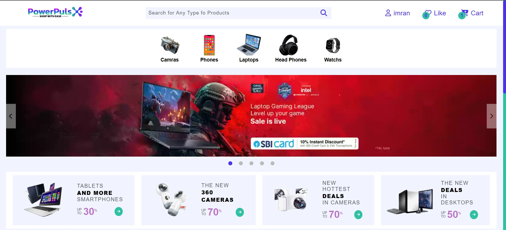

PowerPulse - Electronics E-Commerce Platform

PowerPulse is a modern e-commerce platform built with Vite, Vanilla JavaScript, HTML, and CSS, specializing in electronic goods. Designed for performance and simplicity, it delivers a fast, user-friendly shopping experience with clean UI and essential e-commerce features, all powered by JSON API data integration.

Why PowerPulse?
⚡ Blazing Fast - Vite-optimized builds for instant loading

🛒 Essential Features - Product browsing, cart, and checkout

📱 Responsive Design - Works perfectly on all devices

🔄 Dynamic Data - Real product information via JSON API

🛠️ Lightweight - No heavy frameworks, just vanilla JS

